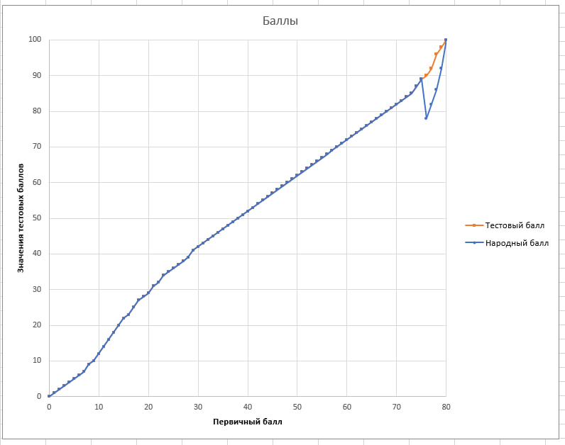

## How to run

Wanna run this stuff?

Install python 3.9+ \
Make your virtual env. \
Install requirements. \
```
pip install -r ./requirements.txt
```
And run.

## Premise

The data is taken from [РИКЗ - Республиканский Институт Контроля Знаний](https://rikc.by/). 

Here is the exact file [PDF URL](https://result.rikc.by/ru/testing/2022/01-02.pdf).
UPD. The Link no longer works (404). Hence the downloaded PDF is the only source for the data to base the analysis on. \
In my opinon, such moves by government only add ambiguity and cover up the problem with how points distributed during the exam.

The script extracts the data from a single file, that was structured as a table with 'Initial Score' and 'Test Score' columns.

## More Notes of the Scandal

If you have ever heard about Belarus, you can check the [scandal](https://news.zerkalo.io/life/40381.html?c) that is going on right now with this new Exam and statistics behind it, results in lowering the score ('Test Point') after converting 'Initial Points' to it.

The conversion resembles ECDF plot. 

But see what happened (if we add 'Vox Populi Score'):



And if before ongoing exams only 10% of test scope had values 75-80 for 'Test Points', right now ~20% have such values, and that is the underlying problem with the conversion (the better writes the test and higher the 'Initial Points; value is, the more competitive results are, and a single point can draw you down on 14 positions).
